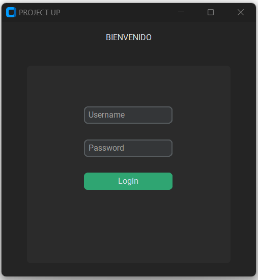
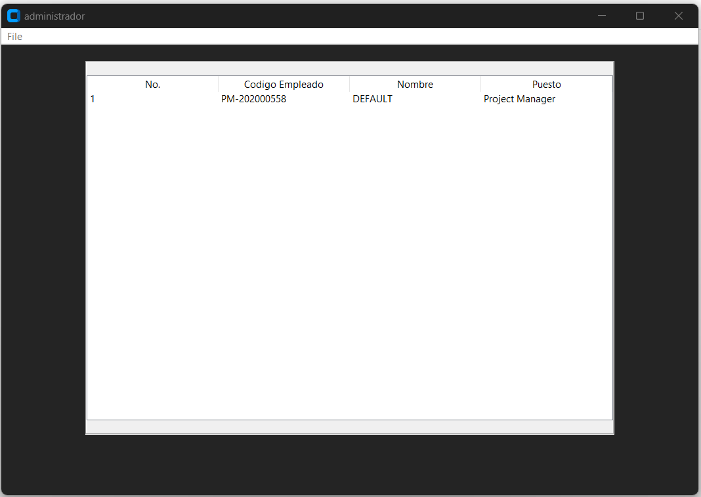
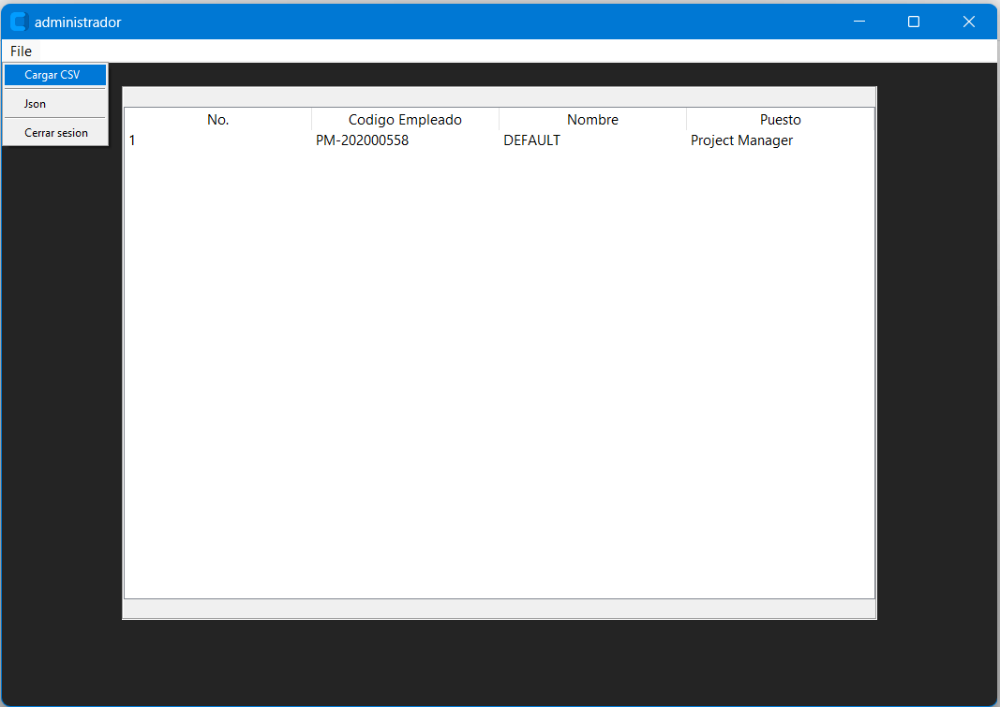
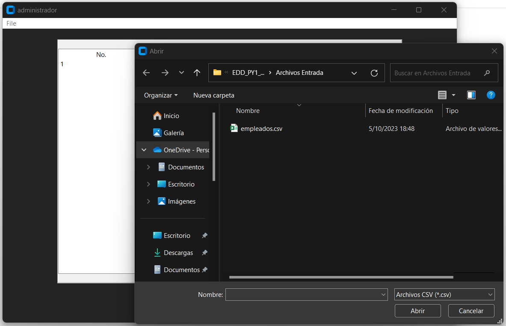
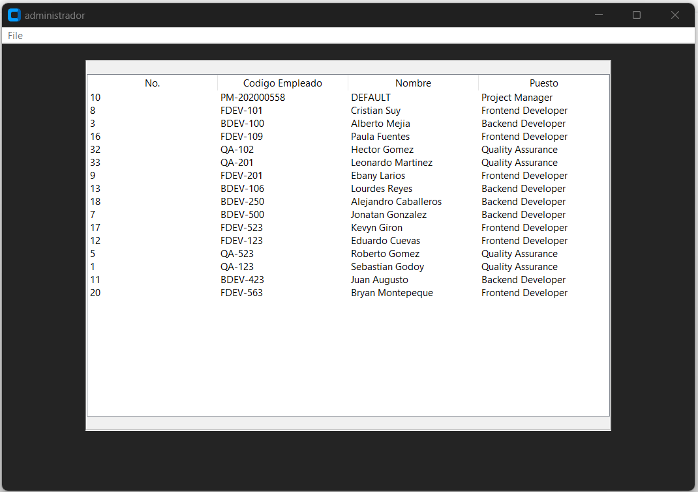
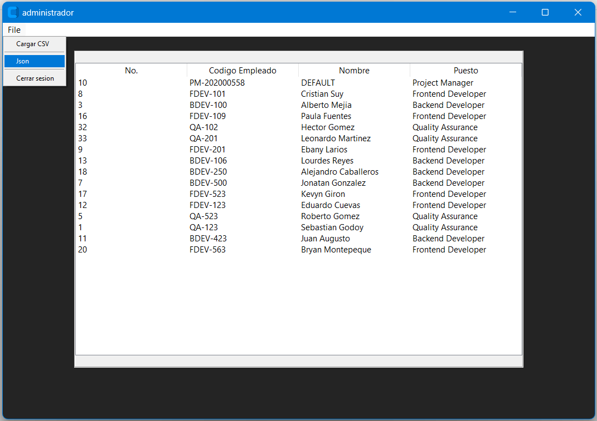
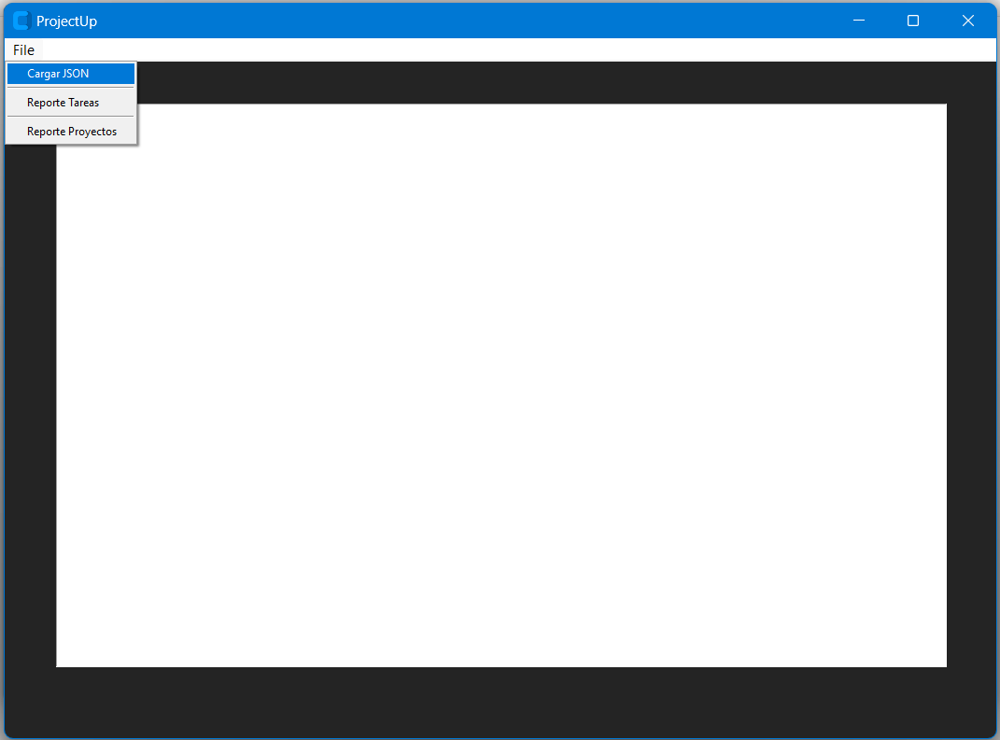
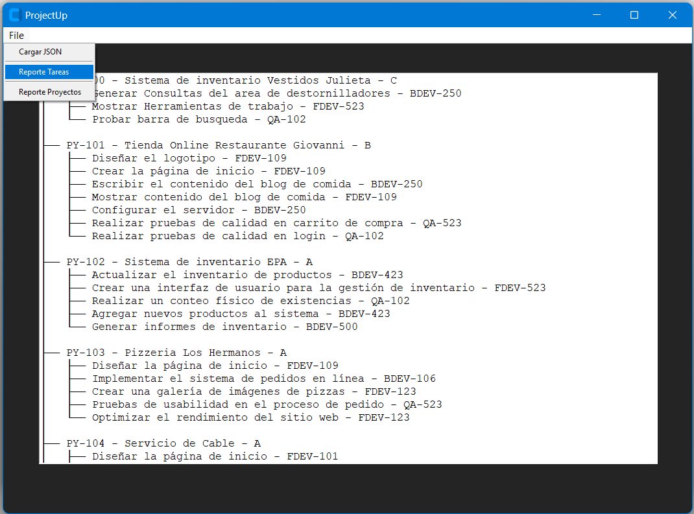
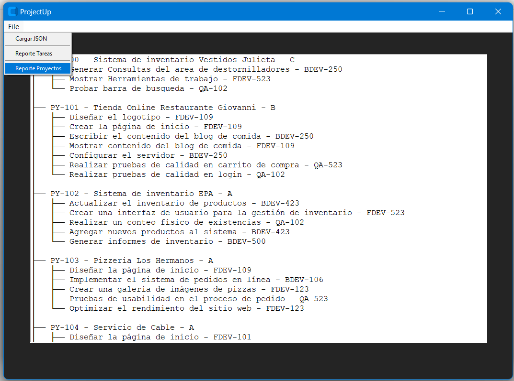
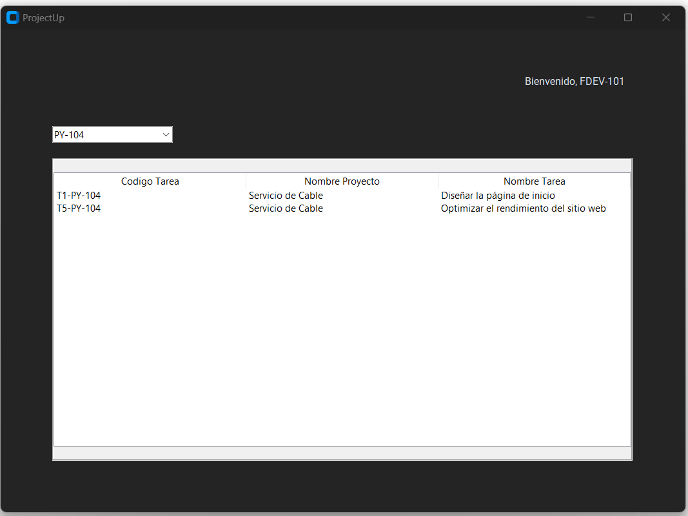

# MANUAL DE USUARIO
## INFORMACIÓN DEL SISTEMA
*El programa fue diseñado específicamente para satisfacer las necesidades de ProjectUp, una empresa de marketing digital que se ha expandido al desarrollo web. Este sistema permite a la empresa gestionar eficazmente proyectos de desarrollo web y tareas de marketing en una sola plataforma integrada. Su objetivo principal es optimizar la organización, seguimiento y entrega de proyectos, así como la coordinación de tareas de marketing en equipo.*

### RECURSOS NECESARIOS
- 2GB de RAM.
- Windows vista o superior.
- Arquitectura de 32 bits o 64 bits.

### OBJETIVOS
- Utilizar el lenguaje Python para implementar estructuras de datos.
- Utilizar la herramienta Graphviz para graficar las estructuras de datos.
- Definir e implementar algoritmos de búsqueda, eliminación e inserción para árboles y algoritmos de hashing para tablas hash.
- Desarrollar interfaces gráficas en Python.

---
## FUNCIONAMIENTO DEL SISTEMA
1. *Al iniciar el programa se muestra una ventana de login para iniciar sesion como empleado o project manager.*

2. *Al iniciar sesion como project manager muestra una nueva ventana con un menu bar y una tabla.*

3.*El boton Cargar csv permite cargar archivos con extension csv abriendo una ventana emergente para la carga del archivo.*

4.*Luego de se carga el archivo a la tabla para la visualizacion de los datos.*

5. *El boton Json redirige a otra ventana para procesar archivos extension .json*

6.*El boton Json permite agregar archivos para generar reportes graphviz de tareas y proyectos ademas se puede visualizar el contenido del archivo en un cuadro texto.*

10.*Luego de cargados los archivos al sistema se puede iniciar sesion nuevamnente con un empleado.*

11.*Al iniciar sesion como empleado se redirige a una nueva ventana para visulizar los proyectos y tareas de las que es colaborador.*

---